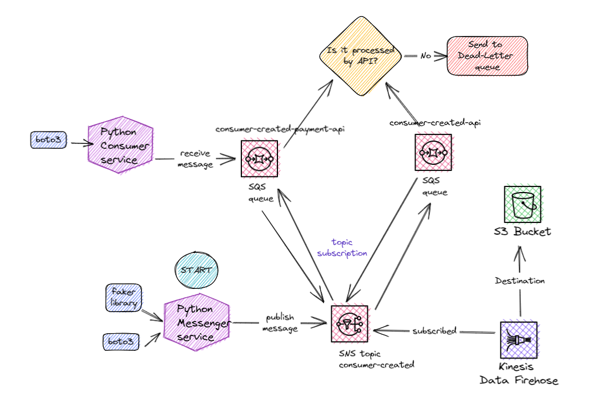

# aws-sns-messenger-ingestor

- boto3

## Documentation

- SNS
https://boto3.amazonaws.com/v1/documentation/api/latest/reference/services/sns.html

- SQS
https://boto3.amazonaws.com/v1/documentation/api/latest/reference/services/sqs.html#SQS.Client.receive_message

- Custom Prefixes for Amazon S3 Objects
https://docs.aws.amazon.com/firehose/latest/dev/s3-prefixes.html

- Subscribing a Kinesis Data Firehose delivery stream to an Amazon SNS topic
https://docs.aws.amazon.com/sns/latest/dg/firehose-endpoints-subscribe.html

- Prerequisites for subscribing Kinesis Data Firehose delivery streams to Amazon SNS topics
https://docs.aws.amazon.com/sns/latest/dg/prereqs-kinesis-data-firehose.html

# Architecture

