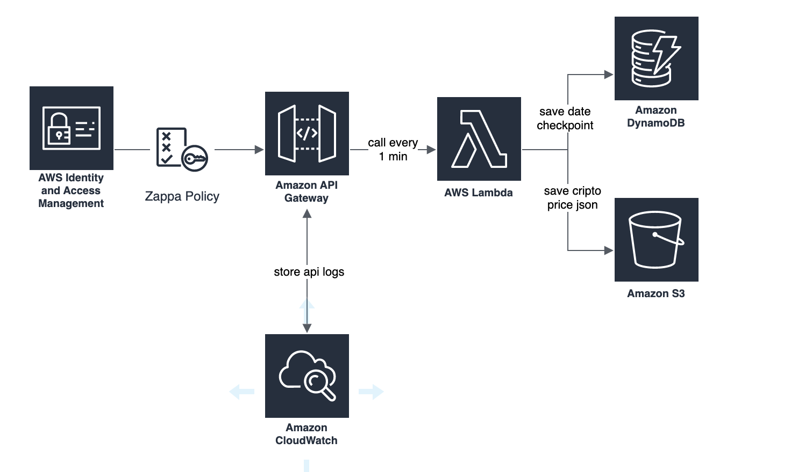

# OOP Data Ingestion Tests AWS

## Run

To run locally:

```bash
$ python -m pytest
```

To run with local code coverage (pytest-cov package)

```bash
$ python -m pytest --cov=mercado_bitcoin tests/
``` 

## Test

### Pytest

Every test needs to be in /tests and each file needs to have 'test' in its filename.

## Build & Deploy

### Makefile

We have a Makefile in root folder. To run it: 
```make init```

### Poetry

Config and run poetry:
```bash
$ poetry init

$ poetry config virtualenvs.create true --local

$ poetry config virtualenvs.in-project true --local
```

Add new dependencies to poetry:

```bash
poetry add requests
poetry add schedule
poetry add ratelimit
poetry add backoff
```

Installing a 'dev' dependency in poetry

```bash
poetry add --dev black
```

### AWS Setup to run your API
1. Create the S3 bucket for ```mercado-bitcoin-exercise-29-11```
2. Check if Dynamo Table doesn't exist
3. Check if you have your Zappa Policy/Role ready with the necessary permissions.
4. Do the zappa init / zappa deploy dev

### Zappa Custom Setup when you're managing the roles, policy and permissions

1. Create a new policy (json extracted from: https://github.com/Miserlou/Zappa/issues/244)
2. Create a new role, attach the policy (for my user)
3. Change at zappa_settings.json to use our role/policy
4. attach new zappa policy created to devwdougherty user
5. At role 'Trust Relationships': Add the ```sts:AssumeRole``` action permission for ```lambda.amazonaws.com``` and ```events.amazonaws.com```for CloudWatch Logs on API Gateway
6. At API Gateway, in our ingestor-api paste our ZappaRole at Settings
7. At API Gateway, in Stage settings Logs/Tracing tab, click to enable CloudWatch Logs (complete instructions here: https://aws.amazon.com/premiumsupport/knowledge-center/api-gateway-cloudwatch-logs/)

#### Toml Python Env

MacOS
```bash
$ source .venv/bin/activate
```

### Black Dependency - code formating

To run black in your code after installing:
```bash
$ black .
```

We can add Black function to ```pyproject.toml```

### Zappa

**How Zappa work?**

Zappa needs an active virtual env. Zappa will zip your project (modules + venv), store it in an S3 bucket and request to AWS Lambda execute a code piece of your previously stored project. The deploy and run will happen according to ```zappa_settings.json```.

For more: https://github.com/zappa/Zappa

**Installing Zappa**

```bash
poetry add --dev zappa
````

**Zappa Cli**

```bash
$ zappa init
$ zappa deploy dev
$ zappa undeploy dev
```

We're going to config a schedule to run our lambda function every 1 minute (see zappa github docs).

# AWS Architecture



# AWS Services

## Lambda
- To pause a lambda function: Go to [Configuration] => [Concurrency] => [Set to 0]

## AWS Cli

To configure first time your AWS credentials and profile:
```bash
aws config
```

Create a Lambda function using an existing policy and code in a bucket:
```bash
aws lambda create-function --function-name test --role arn:aws:iam::249475567305:role/oop-data-ingest-dev-ZappaLambdaExecutionRole  --code S3Bucket=zappa-4jydpv22f
```

# References

## Boto3
https://boto3.amazonaws.com/v1/documentation/api/latest/guide/quickstart.html#configuration

https://boto3.amazonaws.com/v1/documentation/api/latest/reference/services/s3.html

## AWS
https://docs.aws.amazon.com/cli/latest/reference/
https://aws.amazon.com/premiumsupport/knowledge-center/api-gateway-cloudwatch-logs/)

## DynamoDB

##### To handle with DynamoDB - pynamodb
https://github.com/pynamodb/PynamoDB

# TO DO

[X] draw architecture design
[ ] build a container for this app
